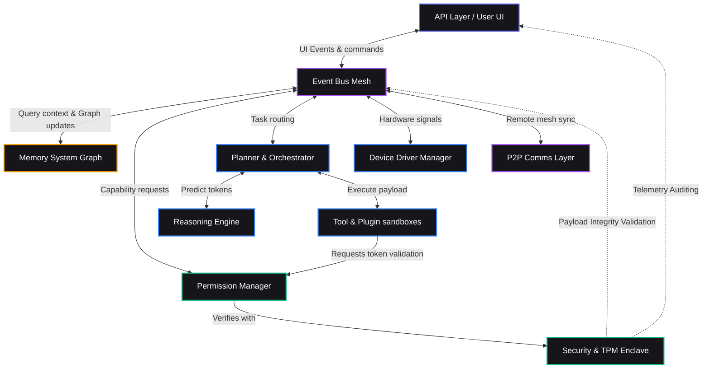

# AETHER SYSTEM ARCHITECTURE: THE BLUEPRINT
**Document ID:** SEC-02-ARCH  
**Version:** 2.0.0  
**Classification:** TECHNICAL SPECIFICATION / INTERNAL ONLY  
**Author:** Core Architecture Group, Aether Systems  

---

## 01. System Overview

Aether is designed as an intelligence-native, decentralized, and decoupled operating system architecture. Rather than treating artificial intelligence as an application running on top of a traditional kernel, Aether structures the entire operating system around an asynchronous, schema-first **Event Mesh**. 

From a bird's-eye view, the architecture separates the probabilistic nature of neural-network inference from the deterministic invariants of standard operating system execution. Every user action, sensor reading, file modification, or model prediction is serialized as a strongly typed event payload and routed through a localized Event Bus. The **Reasoning Engine** and **Planner** act as cognitive schedulers, dynamically decomposing user intentions into discrete tasks, while the **Security Layer** and **Permission Manager** validate and bound these tasks inside strict sandboxed environments before they can interact with physical device hardware.

The system is entirely local-first. It establishes a multi-tiered **Memory System** that maintains semantic context across a user's local physical devices without relying on central database hosts. External networks are treated as untrusted, secondary execution proxies used strictly for high-latency, intensive computations on an opt-in basis.

---

## 02. Core Components

The following sections define each core component, its operational scope, and its architectural dependencies.

```
+-------------------------------------------------------------------------------------------------+
|                                           AETHER CORE                                           |
|                                                                                                 |
|   +-----------------------+   +-----------------------+   +---------------------------------+   |
|   |        KERNEL         |   |        RUNTIME        |   |       COMMUNICATION LAYER       |   |
|   +-----------------------+   +-----------------------+   +---------------------------------+   |
|                                                                                                 |
|   +-----------------------+   +-----------------------+   +---------------------------------+   |
|   |       EVENT BUS       |   |        PLANNER        |   |        REASONING ENGINE         |   |
|   +-----------------------+   +-----------------------+   +---------------------------------+   |
|                                                                                                 |
|   +-----------------------+   +-----------------------+   +---------------------------------+   |
|   |     MEMORY SYSTEM     |   |     TOOL MANAGER      |   |         PLUGIN MANAGER          |   |
|   +-----------------------+   +-----------------------+   +---------------------------------+   |
|                                                                                                 |
|   +-----------------------+   +-----------------------+   +---------------------------------+   |
|   |  PERMISSION MANAGER   |   |    SECURITY LAYER     |   |            SCHEDULER            |   |
|   +-----------------------+   +-----------------------+   +---------------------------------+   |
|                                                                                                 |
|   +-----------------------+   +-----------------------+   +---------------------------------+   |
|   |    DEVICE MANAGER     |   |       API LAYER       |   |       LOGGING & MONITORING      |   |
|   +-----------------------+   +-----------------------+   +---------------------------------+   |
+-------------------------------------------------------------------------------------------------+
```

### 2.1 Aether Core
* **Purpose:** The foundational bootstrap wrapper that initializes the system, manages the lifecycle of primary modules, and coordinates low-level boot parameters.
* **Responsibilities:** Initializing hardware driver bindings, starting the Event Bus, starting the core security enclaves, and monitoring module health.
* **Inputs:** System boot configuration, environment variables, localized hardware descriptors.
* **Outputs:** Signed system initialization event, module state map, hardware-attestation handshakes.
* **Dependencies:** None (absolute root component).

### 2.2 Kernel
* **Purpose:** The native execution driver that interfaces directly with host environments (Linux, macOS, Android, WebAssembly).
* **Responsibilities:** Handling physical File I/O operations, network sockets, physical memory allocation, and process spawn contracts.
* **Inputs:** Host OS system call maps, sandboxed WebAssembly execution contexts.
* **Outputs:** Raw hardware read/write bytes, hardware interrupt mappings, subprocess exit signals.
* **Dependencies:** Aether Core.

### 2.3 Runtime
* **Purpose:** The execution environment that hosts, isolates, and monitors running user applications, tools, and cognitive routines.
* **Responsibilities:** Initializing WebAssembly (Wasm) runtimes, managing execution stack spaces, enforcing CPU and RAM quotas, and collecting diagnostic execution logs.
* **Inputs:** Compiled application binaries (.wasm), runtime configuration bounds.
* **Outputs:** Application state frames, resource violation interrupts, application execution outputs.
* **Dependencies:** Kernel, Security Layer.

### 2.4 Communication Layer
* **Purpose:** The abstraction engine for external networks, handling encrypted peer-to-peer transport and remote API routing.
* **Responsibilities:** Enforcing end-to-end transport encryption, discovery of adjacent local nodes, and scrubbing identifiers from payloads headed to cloud providers.
* **Inputs:** Raw outgoing network data, incoming P2P network handshakes, discovery broadcasts.
* **Outputs:** Scrubbed proxy requests, validated incoming peer payloads, secure local-link tables.
* **Dependencies:** Event Bus, Security Layer.

### 2.5 Event Bus
* **Purpose:** The unified message-passing backbone of Aether OS.
* **Responsibilities:** Routing every event payload to registered subsystem subscribers, maintaining high-throughput local queues, and validating event payload signatures against the Phase 0 schemas.
* **Inputs:** Signed, serialized protobuf-encoded event payloads.
* **Outputs:** De-serialized event streams delivered to target subsystem event loops.
* **Dependencies:** Security Layer (for signature verification).

### 2.6 Planner
* **Purpose:** The cognitive task synthesizer that maps human intentions into deterministic step-by-step execution graphs.
* **Responsibilities:** Decomposing ambiguous requests, dynamically compiling tool-execution sequences, identifying dependency conflicts between tasks, and establishing recovery paths.
* **Inputs:** Human intention statements (parsed), system state descriptors, active context frames.
* **Outputs:** Execution graphs containing step-by-step target tasks, tool requirements, and safety conditions.
* **Dependencies:** Reasoning Engine, Memory System, Tool Manager.

### 2.7 Reasoning Engine
* **Purpose:** The interface controller that abstracts model weights (local SLMs or remote LLMs) into uniform operational sockets.
* **Responsibilities:** Managing model context windows, executing local model inference via hardware-accelerated drivers, and routing token sequences.
* **Inputs:** Normalized prompts, local model weights, inference parameter profiles (temperature, top-k).
* **Outputs:** Raw token predictions, structured JSON schemas, confidence scoring maps.
* **Dependencies:** Kernel (for local GPU/NPU acceleration access).

### 2.8 Memory System
* **Purpose:** The lifelong cognitive storage coordinator that maintains the user's episodic and semantic graph context.
* **Responsibilities:** Vectorizing incoming context frames, maintaining a localized knowledge graph, consolidating outdated episodic records, and performing rapid associative context retrievals.
* **Inputs:** Ephemeral user interactions, system telemetry logs, query descriptors.
* **Outputs:** Relevant contextual facts, historical episodic memories, semantic graph entity associations.
* **Dependencies:** Kernel (for local database storage access).

### 2.9 Tool Manager
* **Purpose:** The registry and safety gatekeeper for all functional capability blocks (e.g., file readers, calculators, external API connectors).
* **Responsibilities:** Checking tool availability, validating input parameters against tool schemas, and executing sandboxed tools on behalf of the Planner.
* **Inputs:** Tool execution requests, parameter payloads.
* **Outputs:** Validated tool execution outputs, performance diagnostics.
* **Dependencies:** Runtime, Permission Manager.

### 2.10 Plugin Manager
* **Purpose:** The manager that validates, loads, and maintains third-party operating extensions.
* **Responsibilities:** Parsing plugin manifests, checking cryptographic signatures of downloaded plugins, and installing them to sandboxed runtimes.
* **Inputs:** Signed plugin packages, update signals.
* **Outputs:** Registered event handlers, active plugin instances.
* **Dependencies:** Runtime, Event Bus.

### 2.11 Permission Manager
* **Purpose:** The state repository and validator for all access rights within Aether.
* **Responsibilities:** Storing user-approved security boundaries, generating cryptographically signed Capability Tokens, and validating token legitimacy.
* **Inputs:** Token generation requests, token validation checks.
* **Outputs:** Signed Capability Tokens, Boolean validation responses (Allow/Deny).
* **Dependencies:** Memory System (for storing permission persistence), Security Layer.

### 2.12 Security Layer
* **Purpose:** The cryptographic root-of-trust provider that secures all system communications, storage blocks, and identities.
* **Responsibilities:** Interfacing with local TPM/HSM hardware, generating and storing system keys, encrypting data at rest (AES-GCM-256), and signing system event packets.
* **Inputs:** Raw data blocks, signature generation payloads, decryption keys.
* **Outputs:** Signed data packets, cryptographically secured filesystems, validated peer identity keys.
* **Dependencies:** Kernel (for low-level TPM/Enclave access).

### 2.13 Scheduler
* **Purpose:** The deterministic processor that schedules tasks and manages the queue of cognitive operations.
* **Responsibilities:** Prioritizing Event Bus messages, scheduling local model inference tasks to prevent GPU/NPU thrashing, and allocating time slices to background sandboxed runtimes.
* **Inputs:** Tasks queue, core priority maps.
* **Outputs:** Scheduled execution signals, CPU process scheduling overrides.
* **Dependencies:** Event Bus, Kernel.

### 2.14 Device Manager
* **Purpose:** The hardware abstraction layer that discovers, authenticates, and manages physical peripheral drivers.
* **Responsibilities:** Discovering camera, microphone, geolocation sensors, and local screens, and translating raw device formats into standardized schema events.
* **Inputs:** Host device state changes, hardware sensory inputs.
* **Outputs:** Standardized sensory events routed over the Event Mesh.
* **Dependencies:** Kernel.

### 2.15 API Layer
* **Purpose:** The user-facing interface gateway, serving ambient web interfaces, local terminal pipelines, and command interfaces.
* **Responsibilities:** Hosting local secure API endpoints, serving UI assets, and handling external CLI socket inputs.
* **Inputs:** User UI interactions, CLI command strings, API requests.
* **Outputs:** UI updates, serialized command events routed onto the Event Bus.
* **Dependencies:** Event Bus, Runtime.

### 2.16 Logging & Monitoring
* **Purpose:** The self-diagnostic auditor that continuously monitors performance, errors, and system invariants.
* **Responsibilities:** Writing cryptographic, tamper-proof logs, tracing event routing pipelines, and alerting the Security Layer when an invariant is violated.
* **Inputs:** System component heartbeats, Event Bus diagnostic packets, warning logs.
* **Outputs:** Cryptographic diagnostic log files, system state alerts.
* **Dependencies:** Kernel, Security Layer.

---

## 03. High-Level Architecture Diagram

The diagrams below demonstrate how Aether's components communicate across boundaries.

### 3.1 Mermaid Flow Diagram



### 3.2 ASCII Schematic

```
                                  +-----------------------+
                                  |   API Layer / User    |
                                  +-----------+-----------+
                                              ^
                                              | [UI Commands & Sensory Streams]
                                              v
+---------------------------------------------+---------------------------------------------+
|                                      EVENT BUS MESH                                       |
|                                                                                           |
|  [Attested Payloads Only]                                       [Strict Interface Routing]|
+-----+-----------------------+---------------+---------------+---------------+-------------+
      ^                       ^               ^               ^               ^
      |                       |               |               |               |
      v                       v               v               v               v
+-----+----+             +----+----+    +-----+----+    +-----+----+    +-----+----+
| SECURITY |             | PERMS   |    | PLANNER  |    | MEMORY   |    | DEVICE   |
| (TPM/   | <=========> | (Tokens |    | (Task    |    | (Graph/  |    | (NPU/GPU/|
| Enclave) |             | & Keys) |    |  Graphs) |    |  Vector) |    |  Sensors)|
+----------+             +---------+    +-----+----+    +----------+    +----------+
                                              ^
                                              | [Step Sequences & Context]
                                              v
                                        +-----+----+
                                        |  REASON  |
                                        | (Weights)|
                                        +----------+
```

---

## 04. Layered Architecture

Aether is organized into a strict, layered architecture. Information flow must propagate sequentially. Direct layer bypasses (e.g., client bypassing the core layer to access the database directly) are structurally forbidden.

### 4.1 Layer Definitions

```
+-----------------------------------------------------------------------+
|  1. USER LAYER (Ambient UI, Web Interfaces, Terminals)                 |
+-----------------------------------+-----------------------------------+
                                    |
                                    v
+-----------------------------------+-----------------------------------+
|  2. CLIENT LAYER (Interface Handlers, App Hooks, Client APIs)         |
+-----------------------------------+-----------------------------------+
                                    |
                                    v
+-----------------------------------+-----------------------------------+
|  3. COMMUNICATION LAYER (Local Event Bus, Peer P2P Link, Proxies)     |
+-----------------------------------+-----------------------------------+
                                    |
                                    v
+-----------------------------------+-----------------------------------+
|  4. CORE LAYER (Planner, Scheduler, Security Enclaves, Tool Manager)  |
+-----------------------------------+-----------------------------------+
                                    |
                                    v
+-----------------------------------+-----------------------------------+
|  5. AI LAYER (Reasoning Sockets, Model Schedulers, Weights)           |
+-----------------------------------+-----------------------------------+
                                    |
                                    v
+-----------------------------------+-----------------------------------+
|  6. EXECUTION LAYER (Wasm Sandboxes, Process Containers)              |
+-----------------------------------+-----------------------------------+
                                    |
                                    v
+-----------------------------------+-----------------------------------+
|  7. MEMORY LAYER (Knowledge Graph, Episodic Shards, Vector Index)     |
+-----------------------------------+-----------------------------------+
                                    |
                                    v
+-----------------------------------+-----------------------------------+
|  8. STORAGE LAYER (AES-GCM-256 Block Filesystem, TPM, Key Rings)      |
+-----------------------------------------------------------------------+
```

1. **User Layer:** Renders the viewport and projects ambient interface elements. It has no knowledge of application logic; it strictly registers inputs and renders structured UI frames.
2. **Client Layer:** Translates raw user inputs into structured system commands and registers hooks for active view state updates.
3. **Communication Layer:** Routes serialized, signed packets over the local Event Bus or translates them into P2P packets for multi-device sync.
4. **Core Layer:** Enforces system invariants. It plans task routing, allocates process scheduling priorities, verifies capability scopes, and manages third-party plugin lifecycles.
5. **AI Layer:** Provides normalized API interfaces to the host's tensor acceleration hardware (NPU/GPU) to run inference on interchangeable open weights.
6. **Execution Layer:** Hosts isolated WebAssembly sandboxes that execute compiled plugins and tools without exposing host system permissions.
7. **Memory Layer:** Encapsulates vector indexing, entity associations, and contextual historical episodic queries.
8. **Storage Layer:** Manages native block filesystems, physical TPM interactions, and localized cryptographic keys.

---

## 05. System Responsibilities

Aether establishes clean division of labor. The table below maps system duties directly to single, non-overlapping components.

| Operational Responsibility | Owning Component | Strictly Excluded Components |
| :--- | :--- | :--- |
| Decomposing user goals into tasks | **Planner** | Reasoning Engine, Tool Manager |
| Executing probabilistic inference token loops | **Reasoning Engine** | Planner, Kernel |
| Generating, signing, and auditing tokens | **Permission Manager**| Security Layer, Event Bus |
| Cryptographic key storage and decryption | **Security Layer** | Memory System, Permission Manager |
| Loading, monitoring, and killing user plugins | **Plugin Manager** | Runtime, Kernel |
| Direct host OS filesystem and process spawning | **Kernel** | Runtime, API Layer |
| Encapsulating episodic, semantic, and vector data | **Memory System** | Storage Layer, Planner |
| Translating physical inputs into standard events | **Device Manager** | API Layer, User UI |

---

## 06. Communication Rules

The Event Mesh operates under strict operational boundaries to prevent architectural degradation:

1. **Strict Asymmetry:** Subsystems do not call each other directly. Direct pointer reference imports, remote procedural calls (RPCs), and shared memory locks are illegal. Subsystem communication is entirely mediated by asynchronous message passing over the Event Bus.
2. **Attested Event Signatures:** The Event Bus will instantly drop any message packet that lacks a valid cryptographic signature signed by an authorized, registered subsystem key.
3. **Protobuf Payload Validation:** All payload data must be serialized in conformant Protocol Buffer format. Any payload failing structural schema validation raises an immediate system-level parsing exception, and the packet is destroyed.
4. **No Ambient Context Leaks:** A component may never attach raw user identifier keys or raw filesystem paths to an Event Bus payload. All filesystem paths inside events must be virtualized and authenticated using local capability scopes.
5. **Fail-Fast Topology:** If Subsystem A issues a Request-Reply message on the Event Bus and Subsystem B does not acknowledge receipt within 250 milliseconds, Subsystem A must assume B has crashed, terminate the thread context, and log a failover event.

---

## 07. Design Decisions & Trade-Offs

### 7.1 Selected Design: Local-First Event Mesh
* **Rejected Alternative:** Monolithic Server-Client Architecture.
* **Why Rejected:** A central server-centric design violates Aether’s core tenet of digital sovereignty. If the network goes offline, the entire operating system loses its ability to route intents, query memory, or run tools. Furthermore, a central server structure represents a massive honeypot of personal user data.
* **Trade-Offs of Chosen Design:** High local compute overhead. Consumer mobile phones and laptops experience increased energy draw and thermal output during heavy model inference and vector graph traversal. Developers must write more complex concurrent state logic to manage asynchronous, P2P network handshakes compared to a single centralized database server.

### 7.2 Selected Design: WebAssembly (Wasm) Isolation for Sandboxing
* **Rejected Alternative:** Native host processes with Linux cgroups or macOS Sandboxing.
* **Why Rejected:** Maintaining native, platform-specific virtualization profiles across heterogeneous OS architectures (Windows, macOS, Linux, Android) introduces massive code maintenance cost and is highly error-prone. A single configuration error in cgroups could expose the host OS filesystem.
* **Trade-Offs of Chosen Design:** WebAssembly sandboxes introduce a 15% to 30% performance penalty on CPU execution speed and add memory allocation overhead. Wasm sandboxes cannot directly execute GPU acceleration kernels without going through virtualized, schema-validated driver proxy bridges.

---

## 08. Scalability Architecture

Aether’s architecture scales gracefully across hardware environments without requiring a refactoring of the code base:

* **Scale-Down (Mobile Devices & Wearables):** The system scales down by hot-swapping heavy model drivers for highly optimized Small Language Models (e.g., 2B-3B parameter quantized models). The Memory System reduces vector dimensions, and background episodic graph consolidation runs strictly when the device is plugged in and charging.
* **Scale-Up (Personal Mesh - Phone & Laptop):** When both devices are mesh-connected over local peer-to-peer Wi-Fi, they dynamically split the planning workload. The laptop acts as the primary inference engine (running a larger 8B-14B model), while the phone captures real-time sensory feeds (camera, location) and routes them as events to the laptop's queue.
* **Scale-Out (Enterprise / Home Servers):** The user registers a private home server or local server racks as an authorized, high-capacity mesh node. Aether automatically routes batch indexing operations, long-term semantic consolidation, and heavy generative modeling tasks to the server via secure local channels, maintaining instant fallback responsiveness on the local device if the server is disconnected.

---

## 09. Failure Handling & Resilience Invariants

The operating system enforces the following recovery behaviors to maintain absolute runtime stability:

```
+------------------+         +-------------------+         +---------------------+
| Component Crash  | ------> | Isolate Sandbox   | ------> | Re-initialize State |
| (AI, Mem, Tools) |         | (Destroy Thread)  |         | (Re-route loop)     |
+------------------+         +-------------------+         +---------------------+
                                                                      |
                                                                      v
                                                           +---------------------+
                                                           | Fallback to Local   |
                                                           | Deterministic Path  |
                                                           +---------------------+
```

* **Memory System Failure:** If the local semantic/vector database experiences corrupted blocks or write lockouts, the system must freeze active graph writes, mount a read-only snapshot memory frame in-memory, and prompt the user to run a database reconstruction task. The system never halts completely.
* **Reasoning Engine Crash:** If the local tensor runner crashes (due to NPU driver faults or memory exhaustion), the system must immediately restart the runtime process, clear the GPU queue, and fall back to a lightweight, CPU-bound backup model. If CPU execution also fails, the Planner falls back to a purely deterministic rule-based template executor.
* **Planner Task Failure:** If the Planner generates a task execution graph that contains invalid parameters or cycles, the system rejects the graph, logs the exact instruction parsing fault, and requests a reformatted planning cycle with a safety-checked constraint template.
* **Network Disconnection:** If the internet connection drops during a cloud execution task, the Communication Layer raises a local routing event. The Planner immediately intercepts the plan, cancels any remote-dependent steps, and reroutes the remaining sub-tasks to local SLM execution profiles.
* **Device Mesh Split:** If a mesh peer goes offline (e.g., the user walks away from their laptop with their phone), both nodes split gracefully. Each node operates independently using its local snapshot database. When reconnecting, they merge context records using deterministic CRDT reconciliation.

---

## 10. Future Expansion Framework

The strict modular boundary of Aether allows seamless integration of future technology verticals without requiring kernel modification:

```
                      +-----------------------------+
                      |   Core Aether Event Mesh    |
                      +--------------+--------------+
                                     |
             +-----------------------+-----------------------+
             |                                               |
             v                                               v
+------------+----------------+             +----------------+------------+
|   Robotics Driver Plugin    |             |   Smart Home Driver Plugin  |
|  - Subscribes: ActionEvents |             |  - Subscribes: SensorEvents |
|  - Emits: ActuatorCommands  |             |  - Emits: DeviceCommands    |
+-----------------------------+             +-----------------------------+
```

* **Robotics Integration:** Robotic joints, limb controllers, and spatial planning engines are registered as standard device plugins. They communicate strictly by subscribing to `ActionEvents` and publishing attested spatial maps back onto the Event Mesh.
* **Smart Home & Vehicles:** Building management systems and CAN bus interfaces map to Aether drivers. The car or smart hub acts as a physical peripheral node inside the user's secure mesh, emitting environmental sensory states and receiving verified command tokens.
* **AR/VR & Spatial Computing:** Eye tracking, hand gestures, and 3D UI projections interface with Aether through the API Layer. The spatial engine treats 3D windows exactly like standard ambient UI frames, with zero direct access to core identity or memory.

---

## 11. Self Review & Principal Architect Critique

This critique provides an objective engineering review of the structural trade-offs made in the Aether specification.

### 11.1 Key Vulnerabilities & Structural Fragility
* **The Inter-Subsystem Latency Tax:** Forcing every single interaction through serialization, signature checking, and event bus routing introduces non-trivial overhead. In highly complex, nested workflows (e.g., real-time voice processing requiring sub-100ms response loops), this event tax could degrade performance.
* **CRDT Resolution Collisions:** While CRDTs handle basic state merges seamlessly, they cannot automatically resolve complex *semantic* conflicts. If a user modifies an architectural concept in their memory graph on device A, and deletes the base components of that concept on device B while offline, reconciling the graph state upon mesh merger requires deep cognitive intervention, risking graph corruption or data loss.

### 11.2 Core Assumptions Challenged
* **Consumer Silicon Access:** We assume that modern NPUs and mobile GPUs will allow low-level, direct memory manipulation. If major hardware manufacturers continue to encapsulate their silicon behind proprietary, cloud-tethered operating structures, Aether’s local inference capabilities could be locked out.
* **Developer Discipline:** The schema-first modular pattern requires immense developer discipline. If external developers begin to write massive, poorly decoupled plugins that bypass the Event Mesh using native host bridge hacks, the safety boundaries of Aether will collapse.

### 11.3 Long-Term 10-Year Risks (2036)
* **The "Graveyard of Memories" Problem:** As a user collects decades of continuous daily context, their memory graph will grow exponentially. Without a highly sophisticated, lossy "forgetting" model, query traversal times over massive local graphs will degrade, causing cognitive operations to slow down significantly on consumer hardware.
* **NPU Obsolescence:** Model formats and tensor execution mechanisms are changing rapidly. If the fundamental architecture of computing shifts away from transformer-based matrix multiplications to new paradigms (like neuromorphic spiking neural networks), Aether’s standard driver sockets will require complete rewrite cycles to map to the new hardware gates.

---

**Certified by the Aether Core Architecture Group, 2026.**  
*Sovereignty. Privacy. Continuity.*
