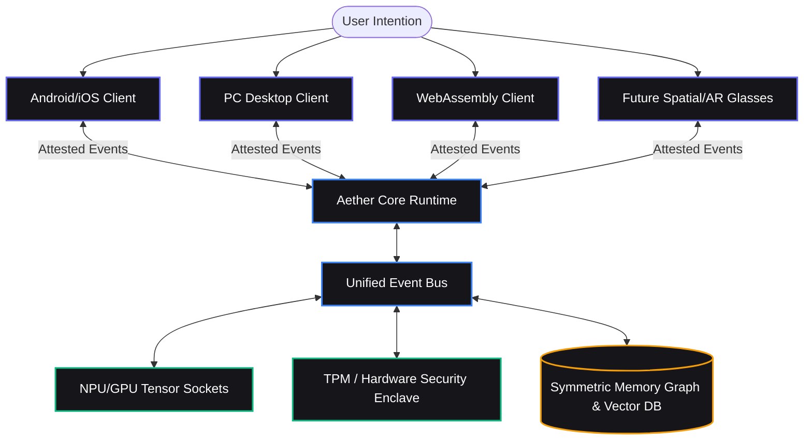
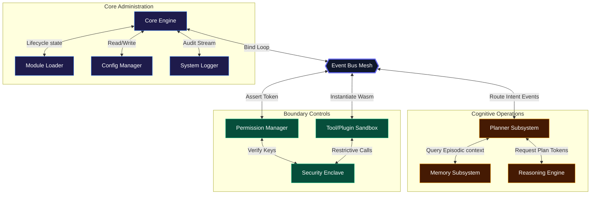
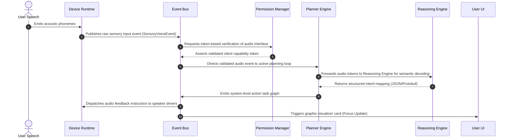
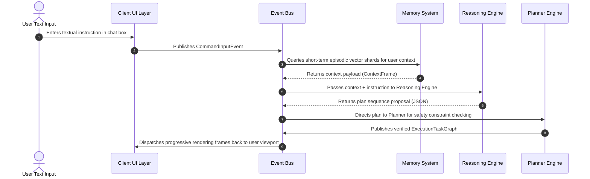
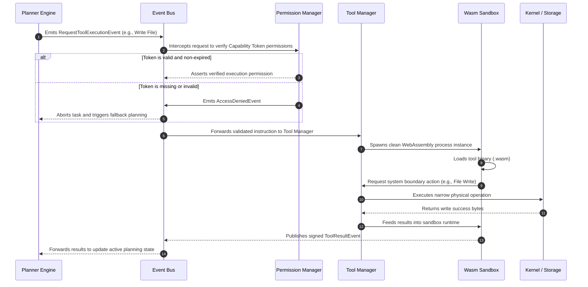
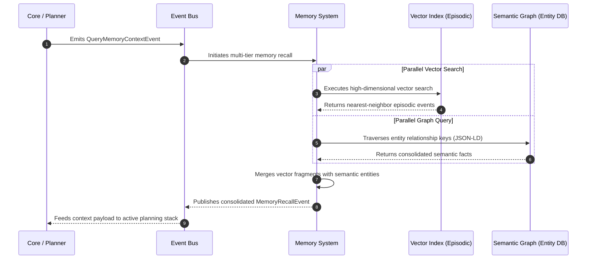
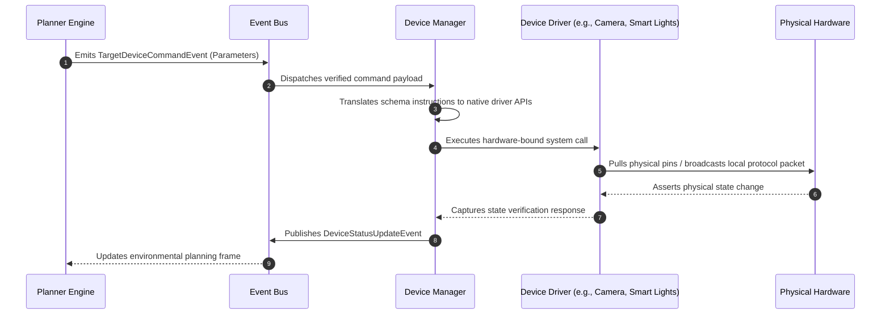

# AETHER COMPONENT SPECTRUM & SCHEMATICS
**Document ID:** SEC-03-COMP  
**Version:** 2.0.0  
**Classification:** TECHNICAL ARCHITECTURE / INTERNAL ONLY  
**Author:** Core Architecture Group, Aether Systems  

---

## 01. High-Level System Diagram

Aether operates as a singular, distributed cognitive operating system framework. Regardless of the physical terminal (Phone, PC, Web browser, or Future wearables), the user interacts with a unified ambient intelligence. Physical devices act as execution runtimes containing the decentralized Aether Core, synchronizing their memory, identity, and plans symmetrically over a secure local peer-to-peer network.

```
+---------------------------------------------------------------------------------+
|                                   USER LAYER                                    |
|              (Speech, Gestures, Keyboard, Vision, Ambient Interfaces)            |
+----------------------------------------+----------------------------------------+
                                         |
                                         v
+---------------------------------------------------------------------------------+
|                                  CLIENT LAYER                                   |
|                (Aether App Shell, Client SDK, Interactive UI Canvas)            |
+----------------------------------------+----------------------------------------+
                                         |
                                         v
+---------------------------------------------------------------------------------+
|                                  AETHER CORE                                    |
|                                                                                 |
|     +---------------+     +---------------+     +---------------+               |
|     |  Phone Node   |     |    PC Node    |     |   Web Node    |               |
|     |  (Android)    |     | (Linux/Win)   |     |  (Wasm/Web)   |               |
|     +-------+-------+     +-------+-------+     +-------+-------+               |
|             ^                     ^                     ^                       |
|             |                     |                     |                       |
|             +---------------------+---------------------+                       |
|                                   |                                             |
|                                   v                                             |
|                     [Symmetric P2P Sync Mesh]                                   |
|                                   |                                             |
|                      +------------+------------+                                |
|                      |  Unified Aether Identity|                                |
|                      |  Lifelong Memory Graph  |                                |
|                      +-------------------------+                                |
+----------------------------------------+----------------------------------------+
                                         |
                                         v
+---------------------------------------------------------------------------------+
|                                PHYSICAL SILICON                                 |
|                     (CPU, GPU, NPU, Local Hardware TPM, Sensors)                |
+---------------------------------------------------------------------------------+
```

### 1.1 Mermaid Multi-Terminal Routing



---

## 02. Internal Component Diagram

The internal subsystem of Aether relies entirely on the **Event Bus** to route messages asynchronously. No internal module maintains a direct memory pointer to another; they are isolated containers orchestrated by the Core Engine.

```
+------------------------------------------------------------------------------------------------------------+
|                                              AETHER CORE RUNTIME                                           |
|                                                                                                            |
|   +----------------------------------------------------------------------------------------------------+   |
|   |                                          CORE ENGINE & LOGS                                        |   |
|   |   +-----------------------+     +-----------------------+     +--------------------------------+   |   |
|   |   |     Module Loader     |     | Configuration Manager |     |             Logger             |   |   |
|   |   +-----------------------+     +-----------------------+     +--------------------------------+   |   |
|   +----------------------------------------------------------------------------------------------------+   |
|                                                      ^                                                     |
|                                                      | [System Loop State]                                 |
|                                                      v                                                     |
|   +----------------------------------------------------------------------------------------------------+   |
|   |                                         ASYNCHRONOUS EVENT BUS                                     |   |
|   +----------------------------------------------------------------------------------------------------+   |
|             ^                     ^                     ^                     ^                     ^      |
|             |                     |                     |                     |                     |      |
|             v                     v                     v                     v                     v      |
|   +------------------+   +------------------+   +------------------+   +------------------+   +------------+   |
|   |    COGNITIVE     |   |     EXECUTION    |   |     SECURITY     |   |      HARDWARE    |   |    COMMS   |   |
|   |                  |   |                  |   |                  |   |                  |   |            |   |
|   |  +------------+  |   |  +------------+  |   |  +------------+  |   |  +------------+  |   |  +-------+ |   |
|   |  |  Planner   |  |   |  |Tool Manager|  |   |  |Permission  |  |   |  |Device      |  |   |  |P2P    | |   |
|   |  +------------+  |   |  +------------+  |   |  |Manager     |  |   |  |Runtime     |  |   |  |Comms  | |   |
|   |                  |   |                  |   |  +------------+  |   |  +------------+  |   |  +-------+ |   |
|   |  +------------+  |   |  +------------+  |   |                  |   |                  |   |            |   |
|   |  | Reasoning  |  |   |  |Plugin      |  |   |  +------------+  |   |  +------------+  |   |            |   |
|   |  | Engine     |  |   |  |Manager     |  |   |  |Security    |  |   |  |Scheduler   |  |   |            |   |
|   |  +------------+  |   |  +------------+  |   |  |Layer       |  |   |  +------------+  |   |            |   |
|   |                  |   |                  |   |  +------------+  |   |                  |   |            |   |
|   |  +------------+  |   |                  |   |                  |   |                  |   |            |   |
|   |  | Memory     |  |   |                  |   |                  |   |                  |   |            |   |
|   |  | System     |  |   |                  |   |                  |   |                  |   |            |   |
|   |  +------------+  |   |                  |   |                  |   |                  |   |            |   |
|   +------------------+   +------------------+   +------------------+   +------------------+   +------------+   |
+------------------------------------------------------------------------------------------------------------+
```

### 2.1 Component Interaction Grid (Mermaid)



---

## 03. Layer Diagram

The Aether framework strictly partitions operational responsibility into eight horizontal layers. Information is processed sequentially down the stack, while hardware interrupts and execution callbacks cascade upward. Direct layer bypasses are structurally illegal.

```
+---------------------------------------------------------------------------------------------------+
|  01. USER LAYER: The human-machine boundary. Gestures, speech phonemes, screen coordinates.        |
+-------------------------------------------------+-------------------------------------------------+
                                                  |
                                                  v
+---------------------------------------------------------------------------------------------------+
|  02. CLIENT LAYER: Translates human actions into standard serialized client request objects.        |
+-------------------------------------------------+-------------------------------------------------+
                                                  |
                                                  v
+---------------------------------------------------------------------------------------------------+
|  03. COMMUNICATION LAYER: Unifies P2P nodes, signs local routing, and executes local Event Bus.   |
+-------------------------------------------------+-------------------------------------------------+
                                                  |
                                                  v
+---------------------------------------------------------------------------------------------------+
|  04. CORE LAYER: Schedulers task pipelines, handles security boundaries, and tracks user plan state. |
+-------------------------------------------------+-------------------------------------------------+
                                                  |
                                                  v
+---------------------------------------------------------------------------------------------------+
|  05. AI LAYER: Schedules NPU access, formats prompt drivers, and queries local model weights.     |
+-------------------------------------------------+-------------------------------------------------+
                                                  |
                                                  v
+---------------------------------------------------------------------------------------------------+
|  06. EXECUTION LAYER: Spins up lightweight, isolated Wasm container blocks to execute plugins.    |
+-------------------------------------------------+-------------------------------------------------+
                                                  |
                                                  v
+---------------------------------------------------------------------------------------------------+
|  07. MEMORY LAYER: Handles entity mapping, semantic graph databases, and local vector indices.     |
+-------------------------------------------------+-------------------------------------------------+
                                                  |
                                                  v
+---------------------------------------------------------------------------------------------------+
|  08. STORAGE LAYER: Interacts with physical block filesystems, TPM gates, and hardware devices.   |
+---------------------------------------------------------------------------------------------------+
```

### 3.1 Layer Description Directory

* **User Layer:** Renders high-fidelity graphical or ambient canvas modules. Captured sensory feedback (such as raw touch gestures or voice waveforms) is directed instantly into the client layer.
* **Client Layer:** Adapts native OS frames to Aether. It hosts state hooks and tracks active view focus elements, presenting a unified UI regardless of whether the platform is desktop or browser-based.
* **Communication Layer:** Houses the localized **Event Bus** and peer discovery servers. It uses cryptographic signing to assert packet origins before broadcasting.
* **Core Layer:** The operational control deck. This layer schedules execution threads, decomposes plans, checks security constraints, and ensures the system maintains high-performance queues.
* **AI Layer:** Abstracts underlying neural hardware. It exposes a uniform tensor execution engine, managing context window rotation and token prediction.
* **Execution Layer:** Restricts plugin and tool capabilities by isolating them inside highly isolated WebAssembly (Wasm) runtimes with zero direct filesystem permissions.
* **Memory Layer:** Orchestrates multi-tiered indexing. It synthesizes incoming experiences into short-term episodic vector shards and long-term semantic knowledge entities.
* **Storage Layer:** Communicates with physical block storage devices. It maintains highly encrypted, tamper-proof local partition sectors utilizing AES-GCM-256 primitives authenticated by hardware TPM chips.

---

## 04. Comprehensive Request Flows

These diagrams trace the exact, step-by-step architectural execution paths of Aether during major operational scenarios.

### 4.1 Voice Request Flow

```
User Voice       Device       Event       Permission      Planner       Reasoning     Device       User
  Speech        Runtime        Bus         Manager       Engine          Engine      Runtime        UI
    |              |            |             |             |              |            |           |
    |--[Phonemes]->|            |             |             |              |            |           |
    |              |--[Event]-->|             |             |              |            |           |
    |              | (Sensory)  |--[Validate]->|            |              |            |           |
    |              |            |<--[Signed]---|            |              |            |           |
    |              |            |                           |              |            |           |
    |              |            |------[Decompose Plan]---->|              |            |           |
    |              |            |                           |--[Predict]-->|            |           |
    |              |            |                           |<--[Tokens]---|            |           |
    |              |            |<-----[Execution Plan]-----|              |            |           |
    |              |            |                                                       |           |
    |              |            |---------------------[Speak response]----------------->|           |
    |              |            |                                                       |--[Audio]->|
```



---

### 4.2 Chat Request Flow



---

### 4.3 Tool Execution Flow

This sequence demonstrates how Aether isolates a tool within a sandbox and verifies access rights before executing a file write.



---

### 4.4 Memory Retrieval Flow



---

### 4.5 Device Control Flow

This flow tracks how an ambient plan interacts directly with physical IoT devices or local peripherals securely.



---

## 05. Module Dependency Diagram

To ensure compile-time prove-ability and avoid runtime errors, Aether strictly enforces a one-way downward flow of architectural dependencies. **Circular dependencies are forbidden.** Lower-level utilities cannot import or reference higher-level components.

```
       +--------------------------------------------------------+
       |                         API Layer                      | (Root Subsystem)
       +---------------------------+----------------------------+
                                   |
                                   v
       +--------------------------------------------------------+
       |                       Core Engine                      |
       +-------+-------------------+--------------------+-------+
               |                   |                    |
               v                   v                    v
       +-------+-------+   +-------+-------+    +-------+-------+
       |   Event Bus   |   |    Planner    |    | Tool Manager  |
       +-------+-------+   +-------+-------+    +-------+-------+
               |                   |                    |
               +---------+---------+                    v
                         |                      +-------+-------+
                         v                      | Plugin Manager|
                 +-------+-------+              +-------+-------+
                 | Reasoning Eng |                      |
                 +-------+-------+                      |
                         |                              v
                         v                      +-------+-------+
                 +-------+-------+              |   Runtime     |
                 | Memory System |              +-------+-------+
                 +-------+-------+                      |
                         |                              |
                         +--------------+---------------+
                                        |
                                        v
                                +-------+-------+
                                | Permission Mgr|
                                +-------+-------+
                                        |
                                        v
                                +-------+-------+
                                |Security Layer |
                                +-------+-------+
                                        |
                                        v
                                +-------+-------+
                                |    Kernel     | (Base Subsystem)
                                +------------------------+
```

---

## 06. Event Flow Diagram

This diagram maps how a user command cascades sequentially through Aether's Event Mesh to trigger physical actions and return state-change feedback.

```mermaid
flowchart TD
    classDef event fill:#15151a,stroke:#6366f1,stroke-width:1px,color:#fff;
    classDef engine fill:#15151a,stroke:#3b82f6,stroke-width:1px,color:#fff;
    classDef output fill:#15151a,stroke:#10b981,stroke-width:1px,color:#fff;

    %% Subsystems & Nodes
    UserEvent([User Action Input]) :::event
    Bus1{{"Event Bus"}} :::engine
    Planner[Planner Subsystem] :::engine
    AI[Reasoning Engine] :::engine
    Tool[Tool Manager] :::engine
    Dev[Device Runtime] :::engine
    Response([Visual/Audio Feedback]) :::output

    %% Data Streams
    UserEvent -->|1. CommandInputEvent| Bus1
    Bus1 -->|2. Route to Active Queue| Planner
    Planner -->|3. Query Prompt Schema| AI
    AI -->|4. Return Action Sequence| Planner
    Planner -->|5. Request Execution| Bus1
    Bus1 -->|6. Check Security Permissions| Tool
    Tool -->|7. Instantiate Sandbox & Run| Dev
    Dev -->|8. Emit Output Event| Bus1
    Bus1 -->|9. Dispatches Render payload| Response
```

---

## 07. Sovereign Device Architecture

Aether treats individual hardware platforms (Linux, Windows, Android, WebAssembly) as standardized, symmetric execution enclaves. A user's identity is not linked to any specific device; rather, each device functions as a nodes within a secure, synchronized compute mesh.

```
+---------------------------------------------------------------------------------------------------+
|                                      SOVEREIGN AETHER PARADIGM                                    |
|                                                                                                   |
|                               +---------------------------------+                                 |
|                               |     Unified Identity Token      |                                 |
|                               |   Lifelong Cryptographic Keys   |                                 |
|                               +----------------+----------------+                                 |
|                                                |                                                  |
|                  +-----------------------------+-----------------------------+                  |
|                  |                             |                             |                  |
|                  v                             v                             v                  |
|   +--------------+--------------+   +----------+--------------+   +----------+--------------+   |
|   |      Android Node           |   |      Desktop Node           |   |       Wasm Node             |   |
|   |  - Local Enclave Core       |   |  - High-Capacity Core       |   |  - Isolated Web Sandbox     |   |
|   |  - 3B Quantized SLM         |   |  - 14B Reasoning Model      |   |  - Event Proxy Interface    |   |
|   +--------------+--------------+   +----------+--------------+   +----------+--------------+   |
|                  ^                             ^                             ^                  |
|                  |                             |                             |                  |
|                  +-----------------------------+-----------------------------+                  |
|                                                |                                                  |
|                                                v                                                  |
|                                  [Local Peer-to-Peer Mesh]                                        |
|                                (Wi-Fi Direct / Bluetooth / LAN)                                   |
+---------------------------------------------------------------------------------------------------+
```

---

## 08. Future Modular Expansion Framework

Adding new technologies (Robotics, Vehicles, Spatial Wearables) requires zero modification of the core Aether Engine. New capabilities plug directly into the Event Bus using standardized schema interfaces and manifest registers.

```mermaid
graph LR
    classDef core fill:#1e1b4b,stroke:#3b82f6,color:#fff;
    classDef plugin fill:#15151a,stroke:#a855f7,stroke-width:2px,color:#fff;

    Bus{{"Event Bus Mesh"}}:::core

    subgraph Core Engine
        Engine[System Kernel]:::core
        Security[Security Enclave]:::core
    end

    subgraph Expansion Modules (Pluggable)
        Robo[Robotics Driver Subsystem]:::plugin
        Auto[Vehicle CAN-Bus Subsystem]:::plugin
        Wear[Bio-Telemetry Wearables]:::plugin
        Smart[Smart Home Controller]:::plugin
    end

    %% Wiring Core
    Engine <--> Bus
    Security <--> Bus

    %% Pluggable Wiring
    Bus <-->|ActionEvents & ActuatorCommands| Robo
    Bus <-->|DriveStates & NavigationCommands| Auto
    Bus <-->|BioMetricStreams & Heartbeats| Wear
    Bus <-->|SensoryUpdates & ToggleCommands| Smart
```

### 8.1 Future Schema Declarations

New modules must declare their event schema signatures in standard, platform-agnostic Protocol Buffer syntax before connecting to the Event Mesh.

```protobuf
// Example Future Schema Signature (Robotic Actuator Subsystem)
syntax = "proto3";
package aether.extension.robotics.v1;

message JointMovementCommand {
  string joint_id = 1;
  double target_angle_rad = 2;
  double target_velocity_rad_sec = 3;
  uint64 expiration_timestamp_utc = 4;
}

message ActuatorSensorState {
  string joint_id = 1;
  double current_angle_rad = 2;
  double force_newtons = 3;
  bool is_stalled = 4;
}
```

---

## 09. Self Review & Architectural Verification

This self-review is compiled by the Core Architecture Group to identify latent structural inconsistencies before system construction.

### 9.1 Potential Structural Inconsistencies & Resolutions

* **The Permission-Manager Latency Loop:**
  * *Vulnerability:* In the *Request Flow* diagrams, the Permission Manager intercepts every event. If the Permission Manager must evaluate cryptographic signatures for high-frequency events (like raw spatial coordinates or audio frames), the system will experience significant latency overhead.
  * *Resolution:* High-frequency sensory events must use specialized **Session Tokens**. Once a peripheral channel is opened, subsequent frames are directed through a fast-path, hardware-accelerated decryption channel, bypassing full Permission Manager re-evaluation for every frame.
* **Symmetric vs. Heterogeneous Core Capacities:**
  * *Vulnerability:* The *Sovereign Device Architecture* states that Aether runs symmetrically across Android and Desktop. However, an Android device cannot execute a 14B model or index millions of memory graph associations without instantly depleting its battery.
  * *Resolution:* The core operating protocols are symmetric, but execution is **profile-adaptive**. Low-resource devices operate in an *enclave-edge* configuration, executing local tasks via lightweight 2B parameters models and offloading heavy vector traversals to nearby desktop mesh peers over encrypted local networks.
* **The Circular Dependency Guardrail:**
  * *Vulnerability:* The *Module Dependency Diagram* places the Tool Manager above the Plugin Manager. However, if a plugin instantiates a tool, the execution path risks creating an upward architectural reference.
  * *Resolution:* Plugins are restricted from accessing the Tool Manager directly. Instead, they must publish structured *ToolRequest* payloads onto the Event Bus. The Event Bus then dispatches these request to the Tool Manager, ensuring complete architectural decoupling.

---

**Certified by the Aether Core Architecture Group, 2026.**  
*Sovereignty. Privacy. Continuity.*
